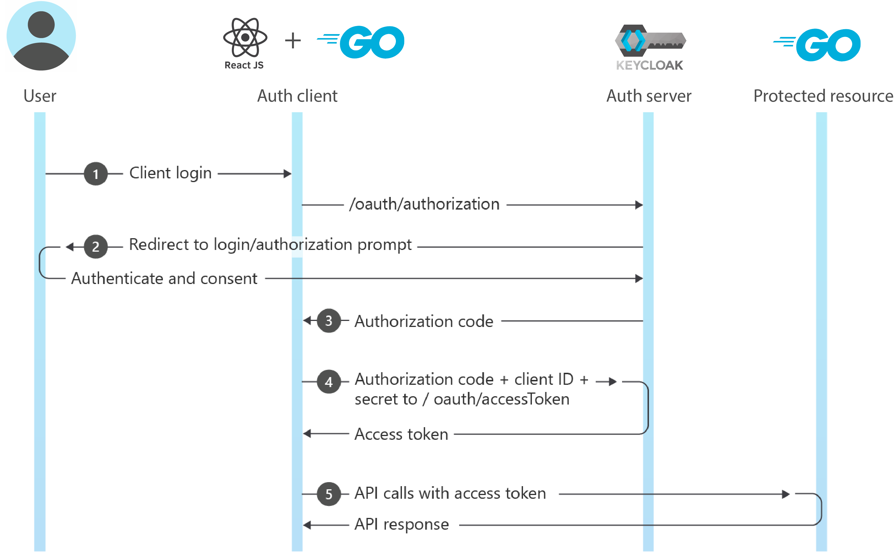
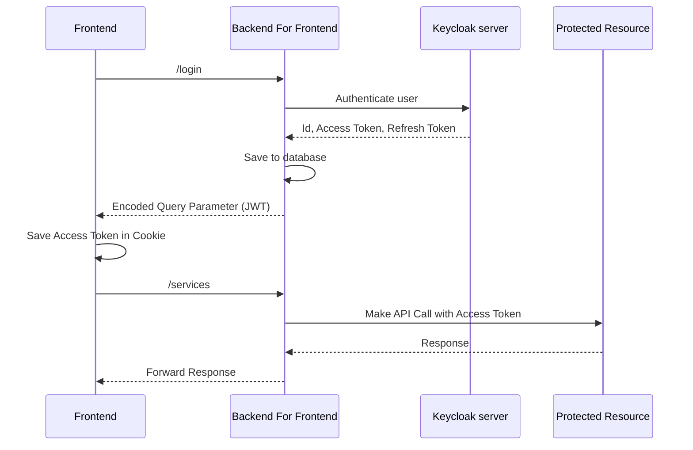

# OAuth Client with Keycloak Integration

<p align="center">
  
</p>

<!-- CONTACTS -->
<div>
    <p align="center">
        <br />
        <a href="#about-project">About Project</a>
        ·
        <a href=mailto:"konstantin.priluchnyi@gmail.com?subject=report%20Bug">Report Bug</a>
        ·
        <a href=mailto:"konstantin.priluchnyi@gmail.com?subject=Request%20Feature">Request Feature</a>
    </p>
    <p align="center">
        <a href=mailto:"konstantin.priluchnyi@gmail.com">
            
        </a>
        <a href="https://t.me/konstantin_evo">
            
        </a>
        <a href="https://www.linkedin.com/in/konstantin-evo/">
            
        </a>
    </p>
</div>

## Table of Contents

- [About the Project](#about-the-project)
    - [Overview](#1-overview)
    - [Authorization Code Flow](#2-oauth-20)
    - [The Backend for Frontend (BFF) Authentication Pattern](#3-the-backend-for-frontend-authentication-pattern)
- [Getting Started](#getting-started)
    - [Run the Project](#1-run-the-project)
    - [Environment Variables](#2-environment-variables)
    - [Project Structure](#3-project-structure)

## About the project

### 1. Overview

This project consists of 4 services that work together to provide authentication and access to
protected resources.

Below is a table that provides information about each service:

| Service               | URL                                                                  | Credentials         | Description                                                                |
|-----------------------|----------------------------------------------------------------------|---------------------|----------------------------------------------------------------------------|
| Authentication Server | [http://auth-server:8080](http://auth-server:8080)                   | admin / admin       | Keycloak-based authentication server for managing users and tokens         |
| Auth Client Frontend  | [http://auth-client-frontend:3000](http://auth-client-frontend:3000) | N/A                 | Frontend application for user login and token management                   |
| Auth Client Backend   | [http://auth-client-backend:8081](http://auth-client-backend:8081)   | N/A                 | Backend for Frontend service for handling authentication and authorization |
| Protected Resource    | [http://protected-resource:8082](http://protected-resource:8082)     | N/A                 | A protected resource that requires valid access tokens for access          |
| Database              | N/A                                                                  | postgres / password | PostgreSQL database for storing user and authentication data               |

Demo:


<p align="right">(<a href="#table-of-contents">back to the Table of content</a>)</p>

### 2. OAuth 2.0

The project implements the OAuth 2.0's Authorization Code Flow to securely authorize users and acquire access tokens.

<p align="center">
  
</p>

In this flow:

1. The user initiates the authentication process by accessing the Auth Client Frontend.
2. The Auth Client Frontend communicates with the secure Auth Client Backend (BFF) implemented in Go, ensuring a
   protected and secure handoff.
3. The Auth Client Backend handles the redirection of the user to the Authentication Server for login.
4. After successful login, the Authentication Server redirects the user back to the Auth Client Backend with an
   authorization code.
5. The Auth Client Backend, being a security layer, ensures the safe exchange of this authorization code for an access
   token and refresh token from the Authentication Server.
6. The access token is used to access protected resources, like the Protected Resource service, which requires a valid
   access token for access.

<p align="right">(<a href="#table-of-contents">back to the Table of content</a>)</p>

### 3. The Backend for Frontend authentication pattern

The Backend for Frontend (BFF) authentication pattern ensuring secure user authentication and authorization. This
pattern is using for controlling access to protected resources and maintaining user security during the
authentication process.

In the context of this project, the BFF authentication pattern is illustrated in the following sequence:



1. **Frontend**: The user interacts with the frontend, initiating the authentication process and making
   requests to protected resources.

2. **Backend for Frontend**: The Backend For Frontend service serves as an intermediary layer
   that ensures secure authentication and authorization for users. It communicates with the Keycloak authentication
   server and securely manages access tokens.

    - When a user logs in, the Backend For Frontend communicates with Keycloak to authenticate the user, receiving an
      ID, an Access Token, and a Refresh Token.
    - The Backend For Frontend stores the received tokens in a database.
    - It responds to the frontend with an Encoded Query Parameter (JWT), which stores in a cookie for future use.

3. **Frontend**: The frontend stores the Access Token in a cookie, ensuring seamless access to protected resources.

4. **Protected Resource**: When the frontend needs to access a protected resource (in this case, the
   ExternalAPI), it includes the Access Token in the request to authenticate and gain access to the protected resource.

<p align="right">(<a href="#table-of-contents">back to the Table of content</a>)</p>

## Getting Started

### 1. Run the Project

To run the project, follow these steps:

1. Clone the repository to your local machine

   ```shell
   git clone https://github.com/konstantin-evo/aouth-with-go.git
   ```

2. Navigate to the project directory

3. Build and start the project using Docker Compose

   ```shell
   docker-compose up
   ```

This will start all the necessary services and components.

**Note**: In some cases, you may need to update your system's hosts file to ensure that the hostnames used in your
project are correctly resolved to their respective IP addresses when using Docker Compose.

To update your hosts file:

- Open a command prompt or terminal window (with administrative privileges).

- Edit the hosts file:

  **For Windows:**

  ```shell
  notepad C:\Windows\System32\drivers\etc\hosts
  ```

  **For Linux/macOS:**

  ```shell
  sudo nano /etc/hosts
  ```

- Add the following entries to the hosts file, replacing `[IP Address]` with the actual IP addresses of your Docker
  containers or localhost (127.0.0.1):

  ```
  [IP Address of auth-server-container] auth-server
  [IP Address of auth-client-backend-container] auth-client-backend
  [IP Address of auth-client-frontend-container] auth-client-frontend
  [IP Address of protected-resource-container] protected-resource
  ```

  In case of localhost it will be:

  ```
  127.0.0.1 auth-server
  127.0.0.1 auth-client-backend
  127.0.0.1 auth-client-frontend
  127.0.0.1 protected-resource
  ```

- Save the hosts file.

Now, with the updated hosts file, you can use hostnames like "auth-server," "auth-client-backend," "
auth-client-frontend," and "protected-resource" to access your services within your Docker Compose setup.

Remember to restart your project using Docker Compose after making these changes for them to take effect.

<p align="right">(<a href="#table-of-contents">back to the Table of content</a>)</p>

### 2. Environment Variables

This project relies on environment variables for configuration. These variables are defined within the Docker Compose
services to ensure smooth operation. You can either modify them directly in the `docker-compose.yml` file.

Below is a comprehensive list of essential environment variables used in the project, along with the services that
utilize them and a brief description of their purpose:

| Environment Variable        | Used in Service       | Description                           |
|-----------------------------|-----------------------|---------------------------------------|
| `KEYCLOAK_ADMIN`            | Authentication Server | Keycloak admin username.              |
| `KEYCLOAK_ADMIN_PASSWORD`   | Authentication Server | Keycloak admin password.              |
| `DSN`                       | Auth Client Backend   | Database connection information.      |
| `HOST`                      | Auth Client Backend   | Host URL for the Auth Client Backend. |
| `KEYCLOAK_HOST`             | Auth Client Backend   | URL of the Authentication Server.     |
| `FRONTEND_HOST`             | Auth Client Backend   | URL of the Auth Client Frontend.      |
| `PROTECTED_RESOURCE_HOST`   | Auth Client Backend   | URL of the Protected Resource.        |
| `CLIENT_ID`                 | Auth Client Backend   | OAuth 2.0 client identifier.          |
| `CLIENT_SECRET`             | Auth Client Backend   | OAuth 2.0 client secret.              |
| `REACT_APP_AUTH_CLIENT_URL` | Auth Client Frontend  | URL of the Auth Client Backend.       |
| `POSTGRES_USER`             | Database              | PostgreSQL username.                  |
| `POSTGRES_PASSWORD`         | Database              | PostgreSQL password.                  |
| `POSTGRES_DB`               | Database              | PostgreSQL database name.             |
| `KEYCLOAK_HOST`             | Protected Resource    | URL of the Authentication Server.     |

<p align="right">(<a href="#table-of-contents">back to the Table of content</a>)</p>

### 3. Project Structure

The project is structured as follows:

- `auth-client-bff`: Backend service implemented in Go for authentication and authorization.
- `auth-client-frontend`: Frontend application for user login and token management.
- `auth-server-keycloak`: Keycloak-based authentication server.
- `go-protected-resource`: A protected resource requiring valid access tokens.
- `database`: PostgreSQL database for storing user and authentication data.
- `src`: Additional project resources.

You can find detailed code and configuration in the respective service directories.

```

├── README.MD
├── docker-compose.yml
├── auth-client-bff
│ ├── Dockerfile
│ ├── data
│ │ ├── model
│ │ │ ├── billingResponse.go
│ │ │ ├── frontData.go
│ │ │ └── tokenResponse.go
│ │ └── repository
│ │ ├── postgresRepository.go
│ │ └── repository.go
│ ├── go.mod
│ ├── handlers_auth.go
│ ├── handlers_front.go
│ ├── handlers_helper.go
│ ├── main.go
│ └── routes.go
├── auth-client-frontend
│ ├── Dockerfile
│ ├── package.json
│ ├── public
│ │ ├── favicon.png
│ │ └── index.html
│ ├── server.js
│ └── src
│ ├── App.js
│ ├── component
│ │ ├── AuthBanner.js
│ │ ├── DecodedAccessToken.js
│ │ ├── Header.js
│ │ ├── ProtectedResource.js
│ │ └── TokenDetails.js
│ ├── config.js
│ ├── img
│ ├── index.js
│ └── utils
│ └── cookieUtils.js
├── auth-server-keycloak
│ ├── Dockerfile
│ └── data
│ └── realm-export.json
└── go-protected-resource ├── Dockerfile ├── go.mod ├── handlers.go ├── main.go ├── model │ └── tokenData.go └──
routes.go

```

<p align="right">(<a href="#table-of-contents">back to the Table of content</a>)</p>
